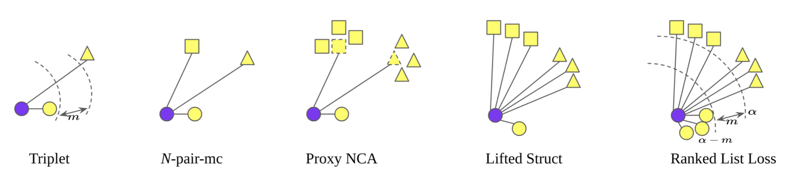

A subset of [CVPR 2019](http://cvpr2019.thecvf.com) papers worth having a look at. Didn't have time to read them or read tweets about them ? 
Here you'll find a TL;DR version of subset (~30) of [paper(s)](http://openaccess.thecvf.com/CVPR2019.py). Assuming you know the state of the art for the problem investigated in the paper. 

`DONE : 3/32 `

### [Unsupervised Deep Tracking](http://openaccess.thecvf.com/content_CVPR_2019/papers/Wang_Unsupervised_Deep_Tracking_CVPR_2019_paper.pdf)

Visual tracking as similarity search. Extract features from a query **q-bbox** of car f.ex and [compute a distance metric](http://www.robots.ox.ac.uk/~luca/siamese-fc.html) over all spatial locations in a target image. Penalise all locations where **q-bbox** and target **t-bbox** don't match.  For this one would need annotation of the object being tracked. One could use a ranking objective or product regression targets and compute IOU loss. Why use annotation when you can play the video forwards and backwards. A good tracker should do both. Given a query **q-bbox** find the best **t-bbox** in another video frame. Use the **t-bbox** as query now and a good tracker should be able to recover the **q-bbox**. If it doesn't penalise with IOU loss.

### [Do Better ImageNet Models Transfer Better?](http://openaccess.thecvf.com/content_CVPR_2019/papers/Kornblith_Do_Better_ImageNet_Models_Transfer_Better_CVPR_2019_paper.pdf) 

Yes. Models which do better on a base task (Task-1) transfer nicely to another (Task-2). Training MobileNetV2 on ILSVRC2012 (Task-1) and fine-tuning on MS COCO for Semseg (Task-2). Semseg would do better if you used a better base model f.ex ResNet101 which has higher accuracy on ILSVRC2012. Where does this break down
- If Task-2 is not a natural extension of Task-1. F.ex Image Aesthetics
- Dataset For Task-2 is as large as for Task-1
- Regularisation applied for Task-1 (weight decay, weight norm) harms Task-2
Why does this happen - No clear answer : Authors speculate large canvas over-paramaterised networks are better at finding the plateau which is suitable for Task-2

### [Learning to Sample](http://openaccess.thecvf.com/content_CVPR_2019/papers/Dovrat_Learning_to_Sample_CVPR_2019_paper.pdf)
Compressing 3D point clouds while preserving downstream task accuracy. Using a model which process 3D point clouds. First convert each 3D point to a feature vector using [1x1 convolutions](https://web.stanford.edu/~rqi/pointnet/docs/cvpr17_pointnet_slides.pdf). Run global max-pooling feature wise. Add **few** dense layers and generate sampled 3D point cloud. Nutshell - 3D input Nx3 to PointNet output Kx3. The generated point clouds is not guaranteed to be a subset of input. Do a NN matching with L2 distance to match. The matching process is only applied at inference time, as the final step of inference. During training, the gener- ated points are processed by the task network as-is, since the matching is not differentiable and cannot propagate the task loss. What if you want sampling size K as part of the network ? Train an network which input & output is Nx3 except that the points are ordered according to their importance in minimising a downstream task. YOLO

### [Fully Quantized Network for Object Detection](http://openaccess.thecvf.com/content_CVPR_2019/papers/Li_Fully_Quantized_Network_for_Object_Detection_CVPR_2019_paper.pdf)

### [Learning Metrics from Teachers: Compact Networks for Image Embedding](http://openaccess.thecvf.com/content_CVPR_2019/papers/Yu_Learning_Metrics_From_Teachers_Compact_Networks_for_Image_Embedding_CVPR_2019_paper.pdf)

### [What Do Single-view 3D Reconstruction Networks Learn?](http://openaccess.thecvf.com/content_CVPR_2019/papers/Tatarchenko_What_Do_Single-View_3D_Reconstruction_Networks_Learn_CVPR_2019_paper.pdf)

### [Zoom to Learn, Learn to Zoom](http://openaccess.thecvf.com/content_CVPR_2019/papers/Zhang_Zoom_to_Learn_Learn_to_Zoom_CVPR_2019_paper.pdf)

### [Unsupervised Image Captioning](http://openaccess.thecvf.com/content_CVPR_2019/papers/Feng_Unsupervised_Image_Captioning_CVPR_2019_paper.pdf)

### [Ranked List Loss for Deep Metric Learning](http://openaccess.thecvf.com/content_CVPR_2019/papers/Wang_Ranked_List_Loss_for_Deep_Metric_Learning_CVPR_2019_paper.pdf)

**Naive triplet** : Sample `[+, anchor, -]` == **triplet**. Pull `+` and `anchor` inside a sphere of diameter alpha - margin. Push -ives outside a sphere of radius alpha. This fails when all your triplet samples become easy to separate and loss is almost zero and your averaged weight gradient over a mini-batch doesn't move the parameters of the DL model. Try other idea **(N-pair-mc)**, build a smarter mini-batch. Take pairs from N different classes and build triplets on the fly. Use positives from different classes as Negatives. This can further improved by instead of pushing all -ives away push a point aways which represents them all. Heuristically computed as the point closest to the `+` sample **(proxy-NCA)**. Use anchor as positive and positive as anchor and you get **Lifted Struct**. **Main idea** : In a batch you have multiple samples of each class. Get a `+` query find all violations of samples belonging to the same class and from -ive set. Computed standard triplet loss for all +ive violations and weighted loss for all -ive violations. weighted by the margin of violation (to get hard negative). Viola you done !

### [Recurrent Neural Network for (Un-)supervised Learning of Monocular Video Visual Odometry and Depth](http://openaccess.thecvf.com/content_CVPR_2019/papers/Wang_Recurrent_Neural_Network_for_Un-Supervised_Learning_of_Monocular_Video_Visual_CVPR_2019_paper.pdf)

### [Arbitrary Style Transfer with Style-Attentional Networks](http://openaccess.thecvf.com/content_CVPR_2019/papers/Park_Arbitrary_Style_Transfer_With_Style-Attentional_Networks_CVPR_2019_paper.pdf)

### [Art2Real: Unfolding the Reality of Artworks via Semantically-Aware Image-to-Image Translation](http://openaccess.thecvf.com/content_CVPR_2019/papers/Tomei_Art2Real_Unfolding_the_Reality_of_Artworks_via_Semantically-Aware_Image-To-Image_Translation_CVPR_2019_paper.pdf)

### [Knowledge-Embedded Routing Network for Scene Graph Generation](http://openaccess.thecvf.com/content_CVPR_2019/papers/Chen_Knowledge-Embedded_Routing_Network_for_Scene_Graph_Generation_CVPR_2019_paper.pdf)

### [Interpreting CNNs via Decision Trees](http://openaccess.thecvf.com/content_CVPR_2019/papers/Zhang_Interpreting_CNNs_via_Decision_Trees_CVPR_2019_paper.pdf)

### [L3-Net: Towards Learning based LiDAR Localization for Autonomous Driving](http://openaccess.thecvf.com/content_CVPR_2019/papers/Lu_L3-Net_Towards_Learning_Based_LiDAR_Localization_for_Autonomous_Driving_CVPR_2019_paper.pdf)

### [Locating Objects Without Bounding Boxes](http://openaccess.thecvf.com/content_CVPR_2019/papers/Ribera_Locating_Objects_Without_Bounding_Boxes_CVPR_2019_paper.pdf)

### [Learning from Synthetic Data for Crowd Counting in the Wild](http://openaccess.thecvf.com/content_CVPR_2019/papers/Wang_Learning_From_Synthetic_Data_for_Crowd_Counting_in_the_Wild_CVPR_2019_paper.pdf)

### [Unsupervised Image Matching and Object Discovery as Optimization](http://openaccess.thecvf.com/content_CVPR_2019/papers/Vo_Unsupervised_Image_Matching_and_Object_Discovery_as_Optimization_CVPR_2019_paper.pdf)

### [Pseudo-LiDAR from Visual Depth Estimation: Bridging the Gap in 3D Object Detection for Autonomous Driving](http://openaccess.thecvf.com/content_CVPR_2019/papers/Vo_Unsupervised_Image_Matching_and_Object_Discovery_as_Optimization_CVPR_2019_paper.pdf)

### [PointConv: Deep Convolutional Networks on 3D Point Clouds](http://openaccess.thecvf.com/content_CVPR_2019/papers/Wu_PointConv_Deep_Convolutional_Networks_on_3D_Point_Clouds_CVPR_2019_paper.pdf)

### [Inserting Videos into Videos](http://openaccess.thecvf.com/content_CVPR_2019/papers/Lee_Inserting_Videos_Into_Videos_CVPR_2019_paper.pdf)

### [Self-Supervised Representation Learning by Rotation Feature Decoupling](http://openaccess.thecvf.com/content_CVPR_2019/papers/Feng_Self-Supervised_Representation_Learning_by_Rotation_Feature_Decoupling_CVPR_2019_paper.pdf)

### [Grounding Human-to-Vehicle Advice for Self-driving Vehicles](http://openaccess.thecvf.com/content_CVPR_2019/papers/Kim_Grounding_Human-To-Vehicle_Advice_for_Self-Driving_Vehicles_CVPR_2019_paper.pdf)

### [Practical Full Resolution Learned Lossless Image Compression](http://openaccess.thecvf.com/content_CVPR_2019/papers/Mentzer_Practical_Full_Resolution_Learned_Lossless_Image_Compression_CVPR_2019_paper.pdf)

### [SoDeep: a Sorting Deep net to learn ranking loss surrogates](http://openaccess.thecvf.com/content_CVPR_2019/papers/Engilberge_SoDeep_A_Sorting_Deep_Net_to_Learn_Ranking_Loss_Surrogates_CVPR_2019_paper.pdf)

### [Where’s Wally Now? Deep Generative and Discriminative Embeddings for Novelty Detection](http://openaccess.thecvf.com/content_CVPR_2019/papers/Burlina_Wheres_Wally_Now_Deep_Generative_and_Discriminative_Embeddings_for_Novelty_CVPR_2019_paper.pdf)

### [Deep Single Image Camera Calibration with Radial Distortion](http://openaccess.thecvf.com/content_CVPR_2019/papers/Lopez_Deep_Single_Image_Camera_Calibration_With_Radial_Distortion_CVPR_2019_paper.pdf)

### [Self-Supervised GANs via Auxiliary Rotation Loss](http://openaccess.thecvf.com/content_CVPR_2019/papers/Chen_Self-Supervised_GANs_via_Auxiliary_Rotation_Loss_CVPR_2019_paper.pdf)

### [Competitive Collaboration: Joint Unsupervised Learning of Depth, Camera Motion, Optical Flow and Motion Segmentation](http://openaccess.thecvf.com/content_CVPR_2019/papers/Ranjan_Competitive_Collaboration_Joint_Unsupervised_Learning_of_Depth_Camera_Motion_Optical_CVPR_2019_paper.pdf)

### [Variational Autoencoders Pursue PCA Directions (by Accident)](http://openaccess.thecvf.com/content_CVPR_2019/papers/Rolinek_Variational_Autoencoders_Pursue_PCA_Directions_by_Accident_CVPR_2019_paper.pdf)

### [PointPillars: Fast Encoders for Object Detection from Point Clouds](http://openaccess.thecvf.com/content_CVPR_2019/papers/Lang_PointPillars_Fast_Encoders_for_Object_Detection_From_Point_Clouds_CVPR_2019_paper.pdf)

### [Leveraging Heterogeneous Auxiliary Tasks to Assist Crowd Counting](http://openaccess.thecvf.com/content_CVPR_2019/papers/Zhao_Leveraging_Heterogeneous_Auxiliary_Tasks_to_Assist_Crowd_Counting_CVPR_2019_paper.pdf)

### [Test of Time Award : Online Dictionary Learning for Sparse Coding](http://thoth.inrialpes.fr/people/mairal/resources/pdf/test_of_time.pdf)