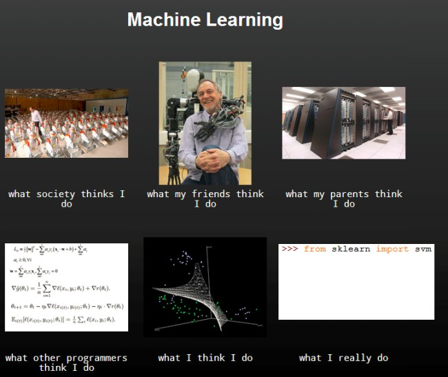

Quoting the researcher D. Ross in her [prior art](https://www.youtube.com/watch?v=4GtyMeEcPPE) explaining how self-supervised video representation learning from rotation works: 

```bash
Upside down
Boy, you turn me
Inside out
And round and round
```


`Is this real life, is this just fantasy` - Self supervised learning in virtual environment(s), Bahnhof, Gorli - Symposium of Localisation Agnostic Canonical Knowledge, 2023. Xberg 



